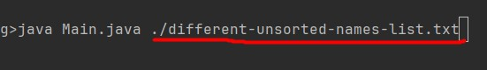

# Name Sorting Application

## A Java sorting application that sorts lists of names within .txt files.
This Name Sorter is a Java program designed to organise a set of names alphabetically. It provides a simple solution for ordering a list of names, based on the individual's surname.

## Table of Contents

- [Deployment](#deployment)
- [Operation](#operation)
- [Test](#tests)
- [Credits](#credits)
- [License](#license)

## Deployment
This program can be handled from the command line using java commands OR using Maven. Using maven will enable you to package and run the program's tests in one line.

### Command Line ###
From the root, navigate to the `davousourting` directory:
`\src\main\java\org\davousorting`

Enter this command:
- `java Main.java ./unsorted-names-list.txt`

This code can also be executed directly from the root folder, though it requires a longer command:

- `java src\main\java\org\davousorting\Main.java ./src/main/java/org/davousorting/unsorted-names-list.txt`

### Maven ###

The following command will build the project, running all the tests for the program.

- `mvn package`

IF YOU DO NOT HAVE MAVEN INSTALLED ON YOUR SYSTEM, USE `./mvmw` INSTEAD OF `mvn`.

## Operation

Once you have entered one of the above commands, the application will print out the list of sorted names in the command line:

Alongside this, the program will create (or overwrite if already created) a .txt file with the sorted names and open it on the screen:

If you want to change the file used in this program, replace the `unsorted-names-list.txt` file within the working directory with a .txt file of your choosing.

Be sure to pass the new file as an argument when executing the code:

## Test

Test can be found within the test directory:

`src\test\java\org\davousorting`

## Credits

Source code created by Davou Jobbi.

Inspiration from Dye & Durham.

## License

MIT License

Copyright (c) [2024] [Davou-Jobbi]

Permission is hereby granted, free of charge, to any person obtaining a copy
of this software and associated documentation files (the "Software"), to deal
in the Software without restriction, including without limitation the rights
to use, copy, modify, merge, publish, distribute, sublicense, and/or sell
copies of the Software, and to permit persons to whom the Software is
furnished to do so, subject to the following conditions:

The above copyright notice and this permission notice shall be included in all
copies or substantial portions of the Software.

THE SOFTWARE IS PROVIDED "AS IS", WITHOUT WARRANTY OF ANY KIND, EXPRESS OR
IMPLIED, INCLUDING BUT NOT LIMITED TO THE WARRANTIES OF MERCHANTABILITY,
FITNESS FOR A PARTICULAR PURPOSE AND NONINFRINGEMENT. IN NO EVENT SHALL THE
AUTHORS OR COPYRIGHT HOLDERS BE LIABLE FOR ANY CLAIM, DAMAGES OR OTHER
LIABILITY, WHETHER IN AN ACTION OF CONTRACT, TORT OR OTHERWISE, ARISING FROM,
OUT OF OR IN CONNECTION WITH THE SOFTWARE OR THE USE OR OTHER DEALINGS IN THE
SOFTWARE.

---