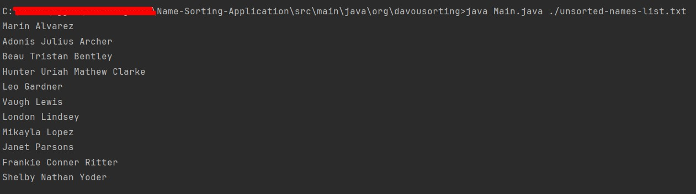
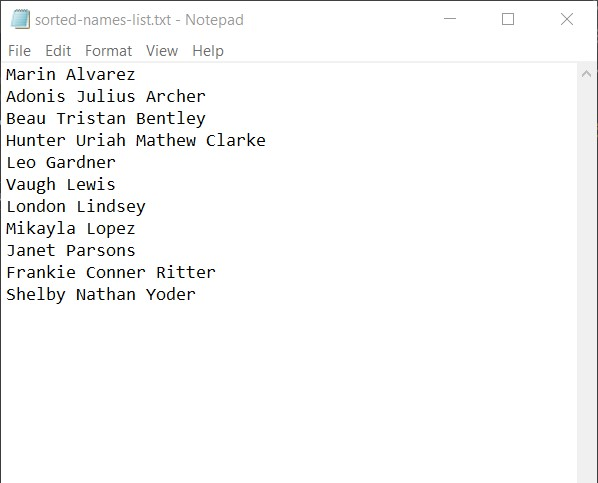
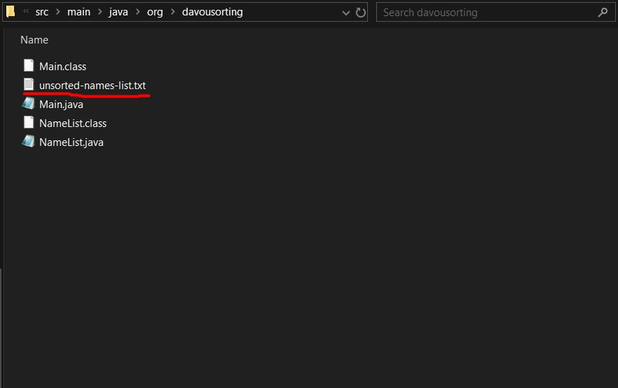

# Name Sorting Application

## A Java sorting application that sorts lists of names within .txt files.
This Name Sorter is a Java program designed to organise a set of names alphabetically. It provides a simple solution for ordering a list of names, based on the individual's surname.

## Table of Contents

- [Deployment](#deployment)
- [Operation](#operation)
- [Test](#tests)
- [Credits](#credits)
- [License](#license)

## Deployment
This program can be executed from the command line:

From the root, navigate to `davousourting` directory:
`\src\main\java\org\davousorting`

Enter this command:
- `java Main.java ./unsorted-names-list`

## Operation
Once you have entered the above command, the application will print out the list of sorted names in the command line:

Alongside this, the program will create (or overwrite if already created) a .txt file with the sorted names and open it on the screen:

If you want to change the file used in this program, replace the `unsorted-names-list.txt` file within the working directory with a .txt file of your choosing.

## Test

Test can be found in

## Credits

Source code created by Davou Jobbi.

Inspiration from Dye & Durham.

## License

MIT License

Copyright (c) [2024] [Davou-Jobbi]

Permission is hereby granted, free of charge, to any person obtaining a copy
of this software and associated documentation files (the "Software"), to deal
in the Software without restriction, including without limitation the rights
to use, copy, modify, merge, publish, distribute, sublicense, and/or sell
copies of the Software, and to permit persons to whom the Software is
furnished to do so, subject to the following conditions:

The above copyright notice and this permission notice shall be included in all
copies or substantial portions of the Software.

THE SOFTWARE IS PROVIDED "AS IS", WITHOUT WARRANTY OF ANY KIND, EXPRESS OR
IMPLIED, INCLUDING BUT NOT LIMITED TO THE WARRANTIES OF MERCHANTABILITY,
FITNESS FOR A PARTICULAR PURPOSE AND NONINFRINGEMENT. IN NO EVENT SHALL THE
AUTHORS OR COPYRIGHT HOLDERS BE LIABLE FOR ANY CLAIM, DAMAGES OR OTHER
LIABILITY, WHETHER IN AN ACTION OF CONTRACT, TORT OR OTHERWISE, ARISING FROM,
OUT OF OR IN CONNECTION WITH THE SOFTWARE OR THE USE OR OTHER DEALINGS IN THE
SOFTWARE.

---